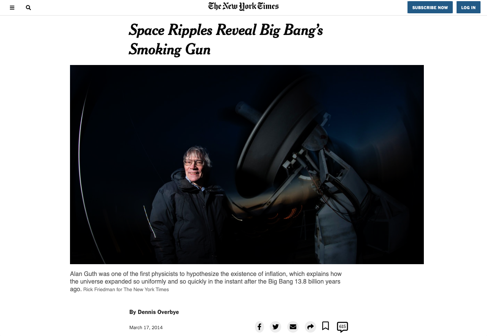

# NewYorkTimes-article-clone
	>This is the third collaborative project from Microverse program.
	>building an HTML and CSS document that matches the appearance of an article from The New York Times webpage.

## Built With :

 - **Html** & **CSS**
 - Using layouts with Flex, Grid and Float.

## Demo Link:
[You can find the project live here](https://rawcdn.githack.com/elasfarc/NewYorkTimes-article-clone/e25afa4cc260c2c4577d1dc8867d944cc9887a95/index.html)

## Authors  

👤 Author1

Github: @elasfarc  

👤 Author2

Github: https://github.com/Fanger53

Twitter: https://twitter.com/DavidLe97005129

Linkedin: https://www.linkedin.com/in/david-castillo-61ba10b8/

## 🤝 Contributing
Contributions, issues and feature requests are welcome!
Feel free to check the issues page.

## Show your support ⭐️
Give a ⭐️ if you like this project!  

## Acknowledgments
Hat tip to anyone whose code was used Inspiration etc 📝 License This project is MIT licensed.
